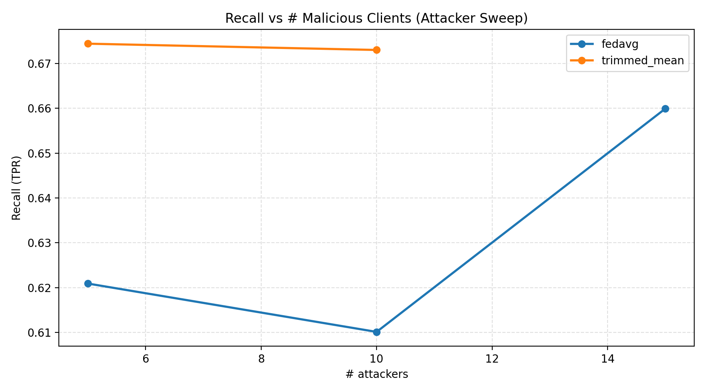
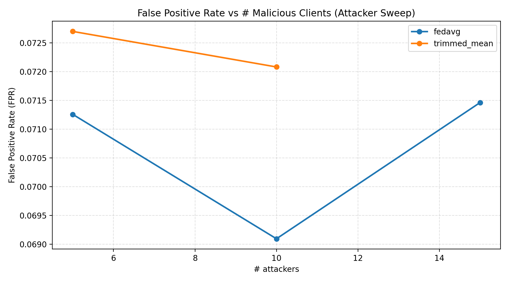
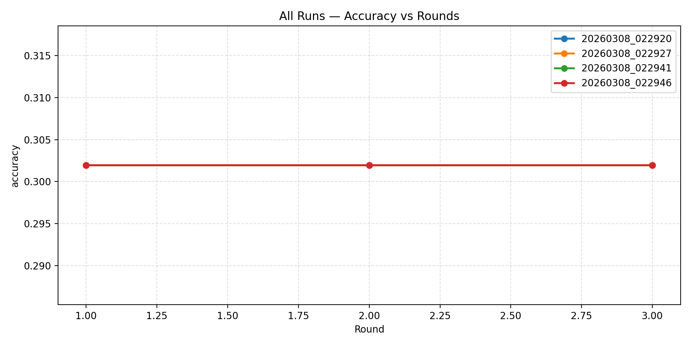
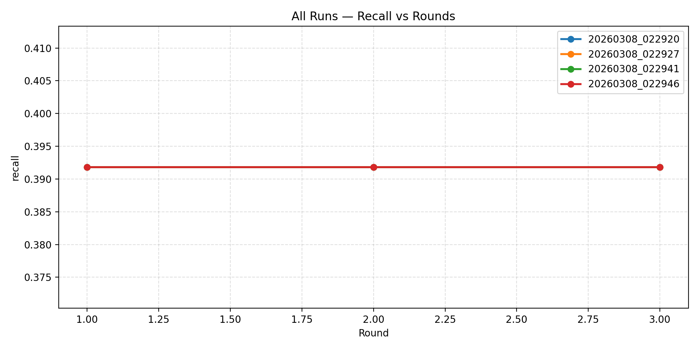
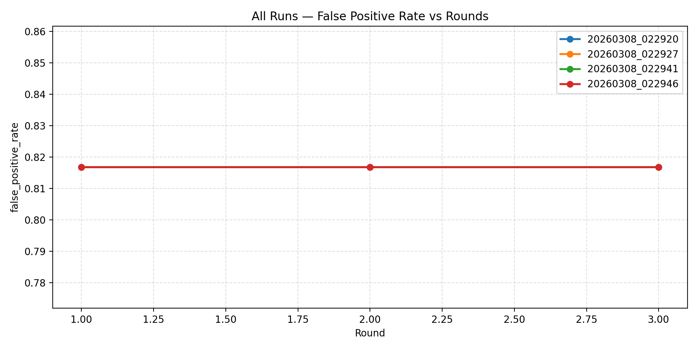

# NSL‑KDD Poisoning‑Resistant Federated IDS (Cross‑Layer Trust + Robust Aggregation)

A practical, demo‑ready **Federated Learning Intrusion Detection System (FL‑IDS)** built on the **NSL‑KDD** dataset.

This repo is designed for a strong viva/demo:
- Run a clean **baseline FL** experiment.
- Simulate **label‑flipping poisoning**.
- Defend using **cross‑layer trust scoring** (cosine similarity + loss stability + cross‑layer consistency) and robust aggregation.
- Every run automatically logs round metrics **locally** into the `runs/` folder.

---

## What problem are we solving?
Traditional IDS training assumes all data is centralized. In real deployments, different organizations or network segments may not be able to share raw traffic logs. Federated Learning (FL) enables collaborative training **without sharing raw data**.

But FL introduces a new threat: **poisoning attacks** (malicious clients send harmful updates). This project demonstrates:
1) the baseline FL‑IDS,
2) how poisoning hurts it, and
3) how poisoning‑resistant aggregation can recover performance.

---

## Research motivation (why this is important)
Existing Federated Learning–based IDS often assume honest participating clients, which is unrealistic in adversarial network environments.

Known gaps this project addresses:
- **Poisoning/backdoor attacks** can severely degrade FL‑IDS performance.
- Many defenses are **generic FL security** and not tailored to IDS needs.
- Prior FL‑IDS defenses often lack **cross‑layer validation**, making it harder to distinguish real traffic anomalies from malicious client updates.
- There is limited work on **trust‑aware aggregation** that dynamically evaluates client reliability during federated training.

---

## Implementation phases (mapped to the repo)
These phases match the methodology-style roadmap used in the project.

### Phase 1 — Dataset setup (NSL‑KDD)
**Input:** `KDDTrain+.txt`, `KDDTest+.txt` (in project root)

What happens:
- Auto-detects delimiter (comma vs whitespace)
- Assigns column names (best-effort)
- Drops the difficulty column when present

CLI:
```powershell
python main.py verify
```

### Phase 2 — Baseline centralized training (sanity check)
What happens:
- Baseline sklearn model (fast sanity check)
- Binary labels: `normal → 0`, `attack → 1`

CLI:
```powershell
python main.py train --binary
```

### Phase 3 — Preprocessing (binary IDS features)
What happens:
- One‑hot encoding: `protocol_type`, `service`, `flag`
- Standard scaling for numeric features
- Binary labels: `normal → 0`, `attack → 1`

> Note: In the FL pipeline this preprocessing is fit once on the union of client data
> (equivalent to global train), then applied consistently to all clients + test.

### Phase 4 — Federated environment simulation (non‑IID clients)
What happens:
- The NSL‑KDD training set is split into **non‑IID clients** with different attack‑family mixtures.

Recommended demo split (2k rows/client works well and runs fast):
```powershell
python main.py split-clients --client-size 2000 --seed 42
```

✅ Scale-up (e.g., **30 clients**):
```powershell
python main.py split-clients --n-clients 30 --client-size 2000 --seed 42 --out data/clients
```

Outputs:
- `data/clients/client_1.csv` … `client_5.csv`
- `data/clients/manifest.json` (family distributions)

For 30 clients (example above):
- `data/clients/client_1.csv` … `client_30.csv`
- `data/clients/manifest.json`

### Phase 5 — Local IDS model (client‑side)
What happens:
- Each client trains a small PyTorch MLP locally (binary classification).
- Only model updates are aggregated (raw client data never leaves the client).

### Phase 6 — Federated Learning experiments (baseline + poisoning)
#### Phase 6A — Clean FedAvg (baseline)
CLI:
```powershell
python main.py fl-train --rounds 5 --local-epochs 1 --device cpu --seed 42 --aggregation fedavg
```

#### Phase 6B — FedAvg + Poisoning (label flipping)
CLI example (poison **client 2**):
```powershell
python main.py fl-train --rounds 5 --local-epochs 1 --device cpu --seed 42 --malicious-clients 2 --label-flip-rate 0.5 --aggregation fedavg
```

**Which clients are poisoned?**
- Poisoning is controlled by `--malicious-clients`, which takes **1-based client indices** corresponding to files in `data/clients/`.
  - `--malicious-clients 2` → poisons `data/clients/client_2.csv`
  - `--malicious-clients 2,5` → poisons `client_2.csv` and `client_5.csv`
- If you want to justify *why* a certain client is chosen (e.g., “high DoS concentration”), cite `data/clients/manifest.json` which stores family distributions per client.

### Phase 7 — Poisoning‑resistant defenses (core contribution)
Two defense options are implemented.

#### Option A (recommended): Trust‑aware aggregation with cross‑layer validation
Trust score combines:
- cosine similarity of client updates
- loss stability
- cross‑layer consistency (network/transport/application feature groups)

CLI example:
```powershell
python main.py fl-train --rounds 5 --local-epochs 1 --device cpu --seed 42 --malicious-clients 2 --label-flip-rate 0.5 --aggregation cosine --cosine-drop-k 1 --trust-alpha 1.0 --trust-beta 0.5 --trust-gamma 0.5
```

#### Option B: Robust aggregation (clipping + robust reducer)
Trimmed mean:
```powershell
python main.py fl-train --rounds 5 --local-epochs 1 --device cpu --seed 42 --malicious-clients 2 --label-flip-rate 0.5 --aggregation trimmed_mean --clip-norm 5 --trim-ratio 0.2
```

Coordinate median:
```powershell
python main.py fl-train --rounds 5 --local-epochs 1 --device cpu --seed 42 --malicious-clients 2 --label-flip-rate 0.5 --aggregation median --clip-norm 5
```

### Phase 8 — Local experiment logging (reproducibility)
Every `fl-train` run stores metrics locally under `runs/<run_id>/`:
- `run.json` — run config + metadata
- `rounds.json` — per-round metrics in JSON
- `rounds.csv` — per-round metrics in CSV (Excel friendly)

This is produced by `nsl_kdd/local_logger.py`.

---

## Repo features
- Dataset loading + preprocessing (binary IDS)
- Non‑IID client simulation
- Baseline FL (FedAvg)
- Poisoning (label flipping)
- Poisoning‑resistant aggregation (trust‑aware + robust)
- Local run logging (`runs/`)

---

## What outputs should you expect?
### Files
When you run `split-clients`, you’ll get:
- `data/clients/client_1.csv` … `client_5.csv`
- `data/clients/manifest.json` (family distributions)

### Local metrics logs
When you run `fl-train`, you’ll get a new folder `runs/<run_id>/` containing:
- `run.json`
- `rounds.json`
- `rounds.csv`

---

## Evaluation metrics (what to report)
This repo reports standard IDS‑friendly binary classification metrics on `KDDTest+.txt`:
- **Accuracy** — overall correctness
- **Precision** — how many predicted attacks are actually attacks
- **Recall (Detection Rate / TPR)** — how many true attacks are detected (very important for IDS)
- **F1-score** — balance between precision and recall
- **False Positive Rate (FPR)** = FP / (FP + TN)

> FPR is now computed automatically by the FL evaluation code and is logged per round
> into `runs/<run_id>/rounds.csv` and `runs/<run_id>/rounds.json`.

### Extra metrics (recommended for report)
Your advisor’s suggestion is solid: add IDS-specific error rates.
At minimum, report:
- **False Positive Rate (FPR)** = FP / (FP + TN)
- **False Negative Rate (FNR)** = FN / (FN + TP)  *(missed attacks)*

(These aren’t currently printed by the CLI, but they are straightforward to compute from a confusion matrix.)

---

## Plots (3 research‑grade figures)
Use the local run logs (`runs/<run_id>/rounds.json` or `rounds.csv`) to generate the three key plots:

### Plot 1 — Accuracy vs FL Rounds
Compare:
- Clean FedAvg
- FedAvg + Poisoning
- Defended FL

### Plot 2 — Recall vs FL Rounds (IDS priority)
Recall is critical in IDS because false negatives mean missed attacks.

### Plot 3 — Trust/Defense signal vs FL Rounds (Phase 7 only)
Shows the defense is active and interpretable (e.g., `trust_mean`, `cosine_sim_mean`, or `dropped_clients`).

### Generate plots
After you have 3 runs saved locally (clean/poisoned/defended), run:

```powershell
python main.py plot --clean "runs/<clean_run_id>" --poisoned "runs/<poisoned_run_id>" --defended "runs/<defended_run_id>" --out-dir figures
```

Output:
- `figures/plot1_accuracy_vs_rounds.png`
- `figures/plot2_recall_vs_rounds.png`
- `figures/plot3_defense_signal_vs_rounds.png`

---

## Attacker count sweep (5 vs 10 vs “high attackers”)
To compare **recall** and **false positive rate** as the attacker ratio increases, use:

```powershell
python scripts/sweep_attackers.py --clients-dir data/clients --attackers 5,10,15 --label-flip-rate 0.3 --aggregation fedavg --rounds 3
```

### Results (30 clients; label-flip-rate=0.3)
Sweep summaries are stored under `figures/sweeps/`.

#### FedAvg (baseline)
Source: `figures/sweeps/attackers_summary.csv`

| # attackers (of 30) | Recall (TPR) | False Positive Rate (FPR) | Accuracy | F1 |
|---:|---:|---:|---:|---:|
| 5  | 0.6614 | 0.0719 | 0.7763 | 0.7710 |
| 10 | 0.6581 | 0.0707 | 0.7749 | 0.7690 |
| 15 | 0.6599 | 0.0715 | 0.7756 | 0.7700 |

#### Trimmed Mean (robust aggregation)
Reproduce:
```powershell
python scripts/sweep_attackers.py --clients-dir data/clients --attackers 5,10 --label-flip-rate 0.3 --aggregation trimmed_mean --rounds 3 --clip-norm 5 --trim-ratio 0.2
```

Source: `figures/sweeps/attackers_summary_20260307_210555.csv`

| # attackers (of 30) | Recall (TPR) | False Positive Rate (FPR) | Accuracy | F1 |
|---:|---:|---:|---:|---:|
| 5  | 0.6744 | 0.0727 | 0.7834 | 0.7799 |
| 10 | 0.6730 | 0.0721 | 0.7828 | 0.7792 |

### Plots for 30-client experiments
To generate comparison plots (Accuracy / Recall / FPR vs rounds) across multiple saved runs, place your run folders under `runs/` and run:

```powershell
python -m nsl_kdd.compare_runs
```

Outputs:
- `figures/comparison/comparison_accuracy.png`
- `figures/comparison/comparison_recall.png`
- `figures/comparison/comparison_false_positive_rate.png`
- `figures/comparison/final_round_summary.csv`

---

## Plots (included in this repo)

### Attacker sweep plots (30 clients)
These plots are generated from `figures/sweeps/attackers_summary*.csv`.

**Recall vs # attackers**



**False Positive Rate vs # attackers**



### Compare runs plots (saved runs under `runs/`)
These plots are generated by `python -m nsl_kdd.compare_runs`.

**Accuracy vs rounds**



**Recall vs rounds**



**False Positive Rate vs rounds**



---

## Server → client feedback (trust signal per round)
When using trust-aware aggregation (e.g., `--aggregation cosine`), the server computes per-client diagnostics each round (cosine similarity, loss stability, cross-layer score) and a **trust score**. To support the future scope "send back to client", this repo now **persists a feedback message for every client every round**.

### Where it is stored
After any `fl-train` run, look inside the run folder:
- `runs/<run_id>/client_feedback.json`

This file is a list of per-round payloads. Each round contains a `clients` list with entries like:
- `client_id` (1-based client index)
- `used` (whether the server used the update this round)
- `trust` (only for trust-aware aggregation)
- `cosine_similarity`, `loss_stability`, `cross_layer`
- `notes` (e.g., `dropped_by_server`)

### CLI example (generates feedback)
This will create a new `runs/<run_id>/` folder containing `client_feedback.json`:

```powershell
python main.py fl-train --clients-dir data/clients --rounds 5 --local-epochs 1 --device cpu --seed 42 --malicious-clients 2 --label-flip-rate 0.5 --aggregation cosine --cosine-drop-k 1 --trust-alpha 1.0 --trust-beta 0.5 --trust-gamma 0.5
```

> Note: for non-trust aggregations (e.g., `fedavg`, `trimmed_mean`), feedback is still written each round, but `trust/cosine_similarity` may be absent.

---

## Tests
```powershell
pytest
```
